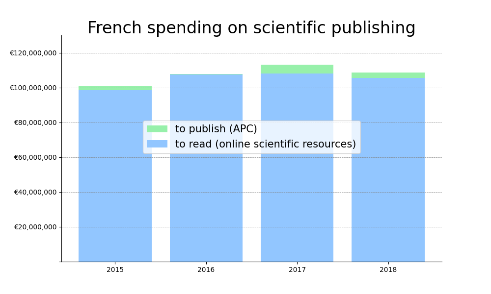
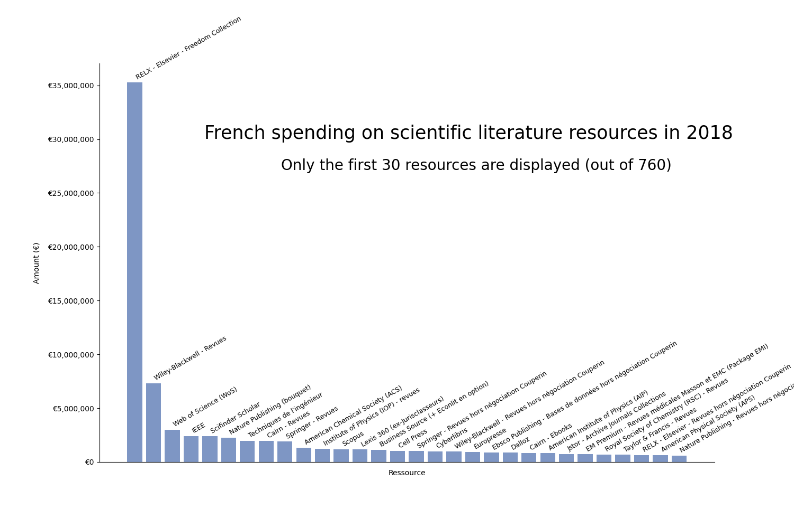

# French expenditure in the scientific publishing system
janv. 2022

Let's cross data from (i) libraries to publishers (payment required so that researcher's can read) and (ii) data from researchers to publishers, what we usually named Article Processing Charges (APC), payments made for publishing.

Limits : a lot of APC are missing. However, the big part of expenditures comes from libraries, so the estimation should not be misleading.

Limits : we do not have datas for recent years :/

----

## Data

* Libraries spending

https://data.enseignementsup-recherche.gouv.fr/explore/dataset/fr-esr-enquete-ressources-electroniques-etablissements/information/  

* APC

https://treemaps.intact-project.org/apcdata/openapc/#institution/country=FRA

