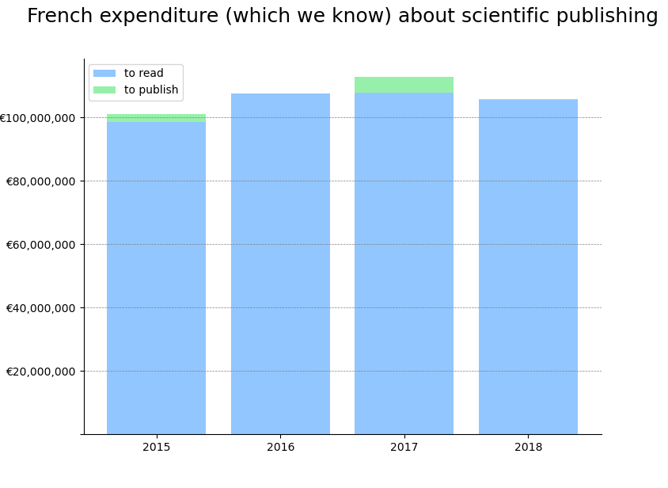

# French expenditure in the scientific publishing system
nov. 2020

Let's cross data from 1.libraries to publishers (payment required so that researcher's car read) and 2. data from researchers to publishers, what we usually named Article Processing Charges (APC), payments made for publishing.

Limits : a lot of APC are missing. However, the big part of expenditures comes from libraries, so the estimation should not be misleading.

## Data
Libraries expenditure
https://data.enseignementsup-recherche.gouv.fr/explore/dataset/fr-esr-enquete-ressources-electroniques-etablissements/information/  
APC 
https://treemaps.intact-project.org/apcdata/openapc/#institution/country=FRA

